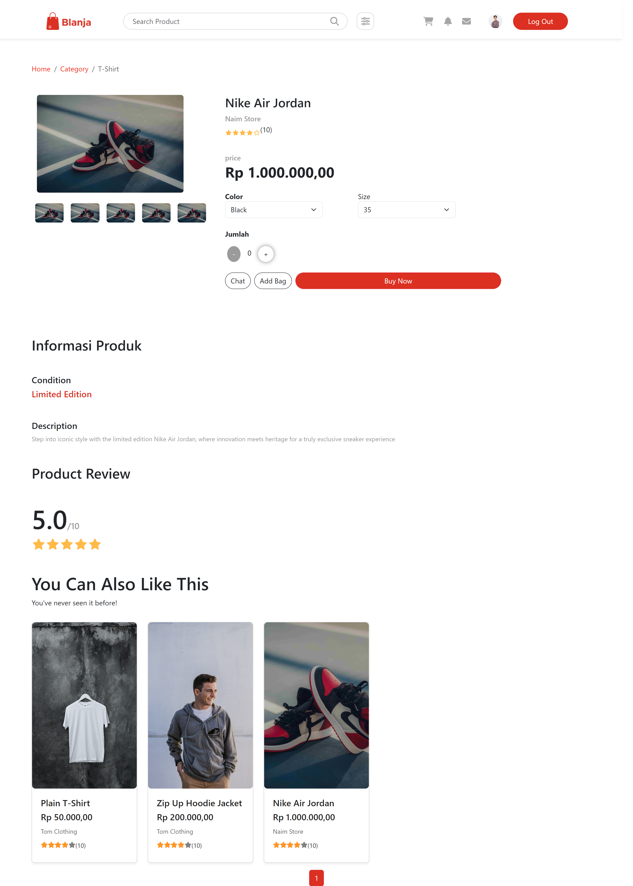

# Blanja Website Team Project

Blanja is an E-commerce website developed as part of a group assignment with a team of 4 members.

## Table of Contents

- [Description](#description)
- [Project Structure](#project-structure)
- [Screenshots](#screenshots)
- [Framework](#framework)
- [Package Dependencies](#package-dependencies)
- [Usage](#usage)
- [Authors](#authors)
- [Related Project](#related-project)
- [Contributing](#contributing)

## Description

Blanja E-commerce Website is a platform where users can buy and sell various products. It focuses on providing a user-friendly interface for both sellers and buyers. The website allows sellers to list their products, manage inventory, and interact with potential customers, while buyers can browse products and make purchases.

## Project Structure

```html
|── Frontend |── public
<!-- Public assets -->
|── src
<!-- Project source code -->
|── assets
<!-- Images used by multer -->
|── components
<!-- Layouts -->
|── pages
<!-- Pages -->
|── redux
<!-- State management -->
|── router
<!-- Endpoints -->
|── .gitignore
<!-- List of files to be ignored by Git -->
|── README.md
<!-- Project documentation for GitHub -->
```

## Framework

[ReactJS](https://react.dev/)

## Package Dependencies

```json
{
  "dependencies": {
    "@fortawesome/fontawesome-svg-core": "^6.4.2",
    "@fortawesome/free-brands-svg-icons": "^6.4.2",
    "@fortawesome/free-regular-svg-icons": "^6.4.2",
    "@fortawesome/free-solid-svg-icons": "^6.4.2",
    "@fortawesome/react-fontawesome": "^0.2.0",
    "@reduxjs/toolkit": "^1.9.6",
    "@testing-library/jest-dom": "^5.17.0",
    "@testing-library/react": "^13.4.0",
    "@testing-library/user-event": "^13.5.0",
    "axios": "^1.5.0",
    "bootstrap": "^5.3.2",
    "bootstrap-icons": "^1.11.1",
    "react": "^18.2.0",
    "react-bootstrap": "^2.8.0",
    "react-dom": "^18.2.0",
    "react-icons": "^4.11.0",
    "react-multi-carousel": "^2.8.4",
    "react-paginate": "^8.2.0",
    "react-redux": "^8.1.2",
    "react-router-dom": "^6.16.0",
    "react-scripts": "5.0.1",
    "sweetalert2": "^11.7.28",
    "web-vitals": "^2.1.4"
  }
}
```

## Usage

To use this project, follow these steps:

1. **Clone This Repository**

   ```bash
   git clone https://github.com/xTats/FE-Blanja-TeamProject
   ```

2. **Install Dependencies**

   ```bash
   cd FE-Blanja-TeamProject
   npm install
   ```

3. **Set Up Database**

   - Create a PostgreSQL database and note down the database name, username, password, and host.

4. **Run the Backend Server**

   ```bash
   npm start
   ```

5. **Start Development Server**

   ```bash
   npm run start
   ```

6. **Access the Website**
   Open your browser and go to [http://localhost:3000](http://localhost:3000) to view the website.

## Screenshots

<details>
  <summary>
    Login Seller
  </summary>

</details>

<details>
  <summary>
    Register Seller
  </summary>

</details>

<details>
  <summary>
    Login Customer
  </summary>

</details>

<details>
  <summary>
    Regiter Customer
  </summary>

</details>
<details>
  <summary>
    Landing Page
  </summary>


</details>
<details>
  <summary>
    Detail Product
  </summary>

</details>
<details>
  <summary>
    My Bag
  </summary>

</details>
<details>
  <summary>
    Checkout
  </summary>

</details>
<details>
  <summary>
    Profile Seller
  </summary>

</details>
<details>
  <summary>
    Seller Edit Profile
  </summary>

</details>
<details>
  <summary>
    Seller My Product Section
  </summary>

</details>
<details>
  <summary>
    Seller List Order Section
  </summary>

</details>
<details>
  <summary>
    Profile Customer
  </summary>

</details>
<details>
  <summary>
    Customer Shipping Address Section
  </summary>

</details>
<details>
  <summary>
    Customer My Order Section
  </summary>

</details>

## Authors

- [Firman Diaz Sukmawan](https://github.com/xTats) - Project Leader & Fullstack Developer
- [Ramdlan Faqih](https://github.com/RamdlanFaqih) - Fullstack Developer
- [Fajar Adi Prasetio](https://github.com/FajarAdi25) - Frontend Developer
- [Muhammad Jajuni](https://github.com/MuhamadJajuni) - Frontend Developer

## Related Project

RESTful API for this web application, clone this for development Blanja.

[BE-Blanja-Team-Project](https://github.com/xTats/BE-Blanja-Team-Project)

## Contributing

Pull requests are welcome. For major changes, please open an issue first to discuss what you would like to change.

Please make sure to update tests as appropriate.
